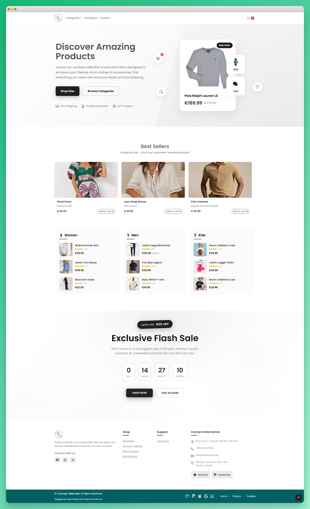
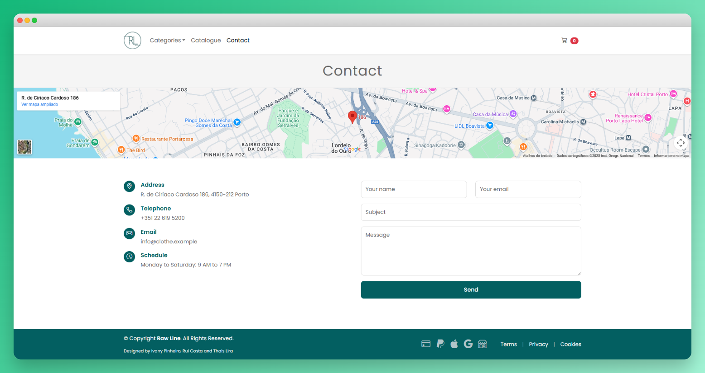
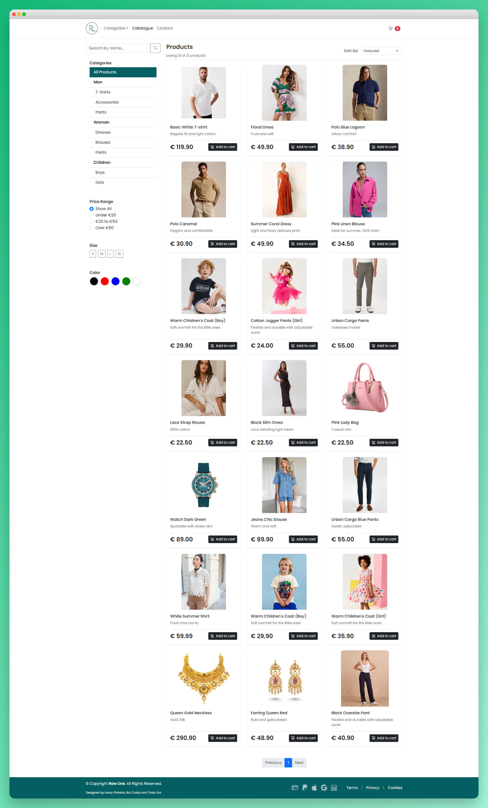
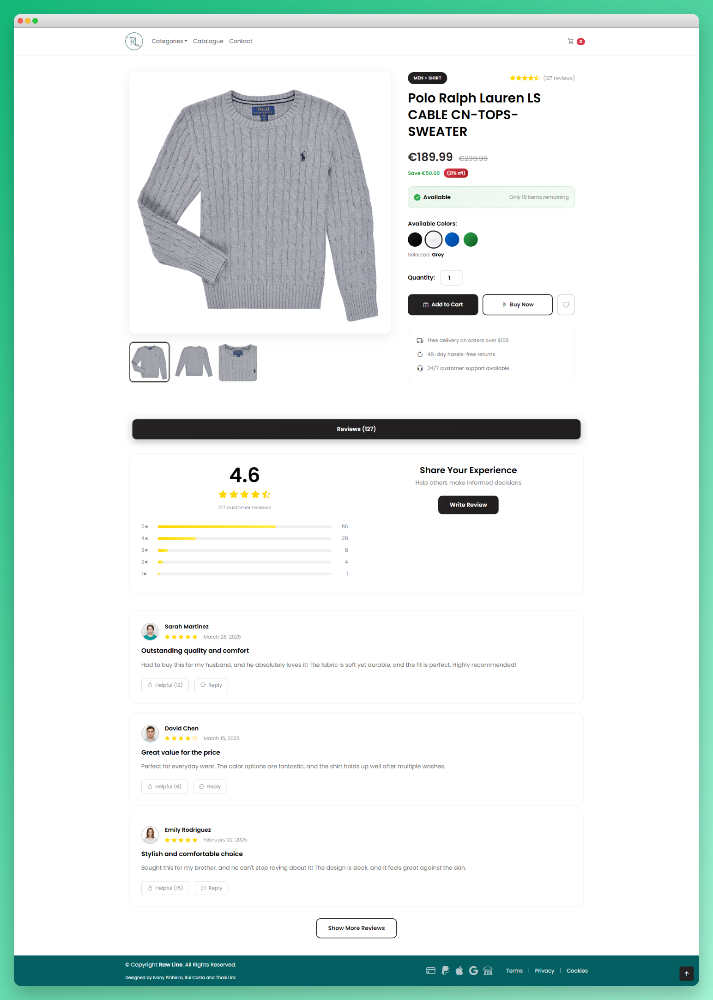
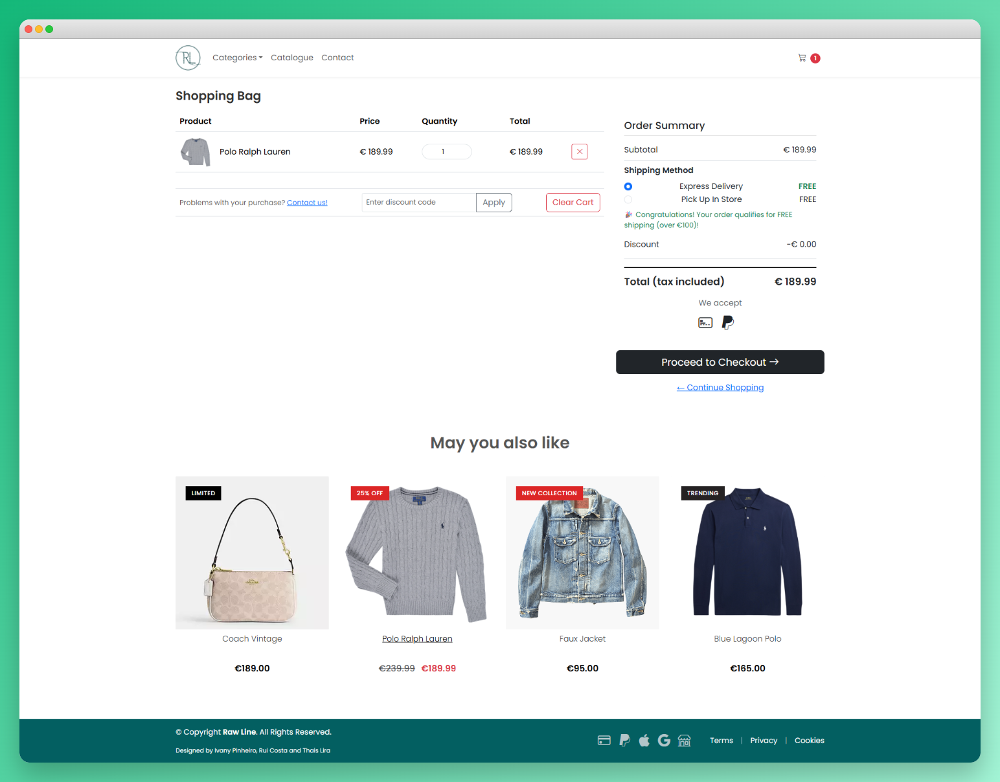
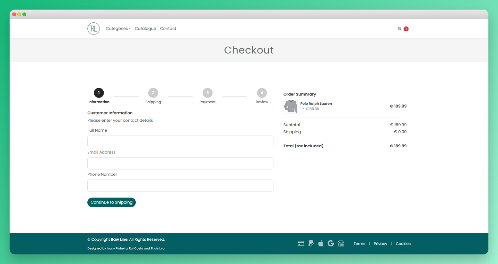

# 👕 Raw Line: Fashion E-commerce Website

A responsive e-commerce web application designed for the fictional fashion brand `Raw Line`. This project simulates an online shopping experience, from browsing a product catalogue to managing a dynamic and interactive shopping cart.

This project focuses on client-side interactivity, responsive UI design and modern front-end development practices using Bootstrap 5, JavaScript (ES6+) and custom CSS.

## 🛍️ Project Overview
The primary goal of this project is to build a functional, beautiful and mobile-first front-end for an online store. It demonstrates the essential functionalities of an e-commerce platform, with a strong focus on JavaScript for managing the application's state (the shopping cart).

### This project highlights skills in:

✔ Building responsive product grid layouts;

✔ Implementing a dynamic shopping cart using client-side JavaScript (e.g., localStorage).

✔ Dynamically updating UI elements (like the cart count in the navbar, item totals, and the order summary) based on user actions.

✔ Using Bootstrap 5 for a modern responsive layout, components (like navbars and modals) and utility classes.

### ✨ Key Features

**🏠 Homepage**: An attractive landing page showcasing featured products, brand information, and intuitive navigation to key sections;

**📦 Product Catalogue**:  A clean grid layout to browse all available products;

**🛒 Dynamic Shopping Cart**: Users can add items to the cart directly from the catalogue page;

**🛍️ Individual Product Pages**: Detailed product information with high-quality images, size/color selection options, and seamless add-to-cart functionality;

**💳 Cart Management**: A dedicated cart page where users can view all items, update quantities, remove individual items, and clear the entire cart;

**📋 Checkout Process**: A complete checkout flow featuring order summary, customer information forms, and payment simulation;

**📞 Contact Form**: A fully functional contact page with comprehensive form validation for customer inquiries and support;

## 🛠️ Technology Stack


## 🚀 Getting Started
To run this project locally, no special build steps are required. Simply clone the repository and open the .html files in your browser.

1. Clone the Repository

```bash 
git clone https://github.com/your-username/WEB-LojaRoupas.git
```
Navigate to the project directory

```bash 
cd WEB-LojaRoupas
``` 

2. Open the index.html or catalog.html file in your preferred web browser.


## ✨ Authors

* <strong>Ivany Pinheiro</strong><br>
    <a href="https://linkedin.com/in/ivanypinheiro" target="_blank"></a> 
    <a href="https://github.com/pin3dev" target="_blank"></a>

* <strong>Rui Costa</strong><br>
    <a href="https://linkedin.com/in/ruifgcosta" target="_blank"></a>
    <a href="https://github.com/ruifgcosta" target="_blank"></a>

* <strong>Thais Lira</strong><br>
    <a href="https://www.linkedin.com/in/thaisrioss/" target="_blank"></a>
    <a href="https://github.com/thaisliira" target="_blank"></a>
    
## 💻 Demo Site

<div align="left">

</div>

### Home Page


### Contact Page


### Catalogue Page


### Product Page


### Cart Page


### Checkout Page
